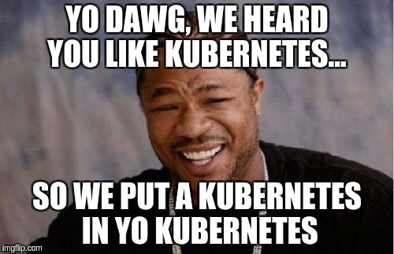

# KINKy
Kubernetes IN Kubernetes yo



Status: **alpha**

## Concept

Spawning (a lot of) Kubernetes clusters via Kubernetes API.

## Goal

After putting a _kinky_ object in a k8s cluster.  A new fully working k8s API should be spawned.  
It should be accessed as a an internal service and with an ingress.

Security is not an option.

## [Why?](/doc/why.md)

## Usage

Create a new cluster via `Kinky` object like:
```yaml
apiVersion: kinky.barpilot.github.com/v1alpha1
kind: Kinky
metadata:
  namespace: my-team
  name: my-kinky
```

Get a Token for _kubelet_ to join.

On any worker server:
```
kubeadm join --token <token> my-kinky.my-team.example.com
```

## Install

### Prerequisites

#### [etcd-operator](https://github.com/coreos/etcd-operator)

_etcd-operator_ is used to manage etcd clusters for spawned k8s.

For the moment, you have to use a [patched version](https://github.com/coreos/etcd-operator/pull/1777) of etcd-operator.
A docker version is available: [guilhem/etcd-operator](https://hub.docker.com/r/guilhem/etcd-operator/)

A deployment can be used: [/artifacts/deployment.yaml](/artifacts/deployment.yaml)

#### [k8sniff](https://github.com/kubermatic/k8sniff)

_k8sniff_ manage access to your spawned k8s.

To work you have to spawn this service and make it listen for external requests.

Requests will be forward to k8s server baser on "HOST" used by client.

### Register CRD

First register the custom resource definition:

```
kubectl apply -f artifacts/kinkies-crd.yaml
```

### Add `Kinky` object

An example of the `Kinky` kind:

```
kubectl apply -f artifacts/my-kinky.yaml
```

### Run operator
Finally build and run the example:

```
go build
./kinky -kubeconfig ~/.kube/config
```
